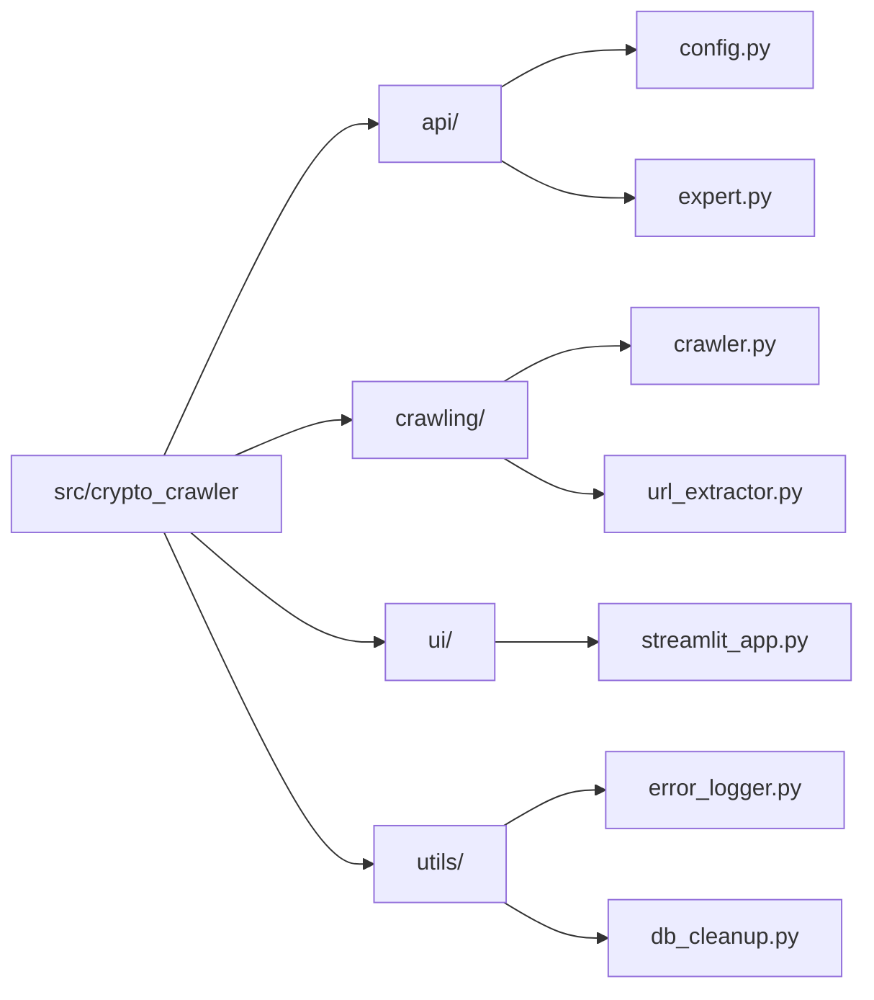
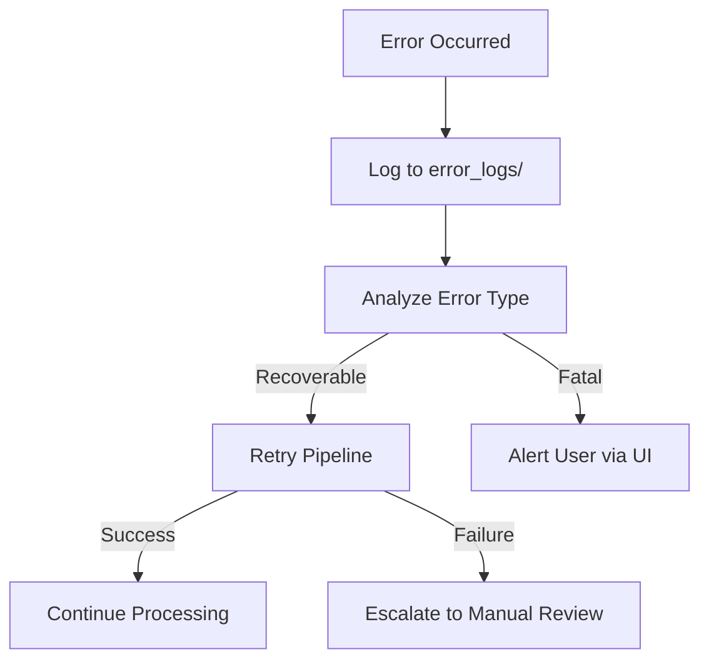
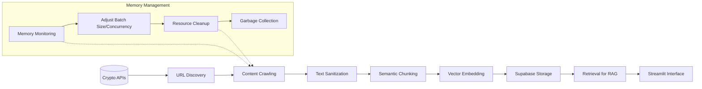
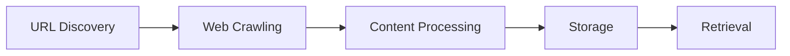

# System Architecture Patterns

## Module Structure


## Error Handling Pipeline


## Data Flow


## Project Structure

The project follows a modern Python package structure with a src-layout approach:

```
crypto_crawler/
├── src/
│   └── crypto_crawler/
│       ├── __init__.py
│       ├── api/
│       │   ├── __init__.py
│       │   ├── config.py
│       │   └── expert.py
│       ├── crawling/
│       │   ├── __init__.py
│       │   ├── crawler.py
│       │   └── url_extractor.py
│       ├── utils/
│       │   ├── __init__.py
│       │   ├── error_logger.py
│       │   └── db_cleanup.py
│       ├── ui/
│       │   ├── __init__.py
│       │   └── streamlit_app.py
│       └── scripts/
│           ├── __init__.py
│           ├── explore_api_url.py
│           ├── generate_api_configs.py
│           ├── test_rag_agent.py
│           └── test_supabase_connection.py
├── config/
│   ├── db_functions.sql
│   ├── get_distinct_api_sources.sql
│   ├── site_pages.sql
│   └── README.md
├── docs/
│   └── crypto-apis.md
├── examples/
├── error_logs/
├── memory-bank/
├── old/
├── setup.py
├── pyproject.toml
├── requirements.txt
├── main.py
└── README.md
```

This structure provides several benefits:
- Clear separation of concerns
- Improved maintainability
- Better testability
- Proper package installation
- Logical organization of code

## Core Components

### 1. API Configuration Management

The system uses a configuration-driven approach to manage the diverse set of cryptocurrency APIs:

- **Configuration Model**: Each API is represented by a `CryptoApiConfig` dataclass that encapsulates all crawling parameters.
- **Dynamic Configuration Generation**: Configurations can be generated from a markdown file listing API providers.
- **Persistence**: Configurations are stored in JSON format for easy editing and version control.
- **Exploration Capabilities**: The system can analyze API documentation sites to recommend optimal crawling parameters.

### 2. URL Discovery and Extraction

Two complementary strategies are employed for discovering documentation URLs:

- **Sitemap-Based Discovery**: For APIs with sitemaps, the system parses XML sitemaps to extract documentation URLs.
- **Crawl-Based Discovery**: For APIs without sitemaps, the system performs a breadth-first crawl to discover documentation pages.
- **Pattern Filtering**: URL patterns (regex) are used to focus crawling on relevant documentation pages.
- **Depth Control**: Configurable crawl depth prevents excessive crawling while ensuring comprehensive coverage.

### 3. Web Crawling

The crawling system is designed for efficiency, reliability, and respect for API providers:

- **Parallel Processing**: Multiple URLs are crawled concurrently with configurable concurrency limits.
- **Rate Limiting**: Configurable delays between requests prevent overloading API servers.
- **Retry Mechanism**: Exponential backoff strategy for handling rate limit errors.
- **Session Reuse**: Browser sessions are reused to improve performance.
- **Error Categorization**: Errors are categorized (rate limit, connection, parsing) for targeted handling.
- **Batch Processing**: URLs are processed in batches to control memory usage and improve reliability.
- **Progress Tracking**: Crawling progress is saved to enable resuming interrupted crawls.
- **Browser Cleanup**: Multi-stage cleanup process including graceful shutdown, forced termination, and temp directory cleanup.
- **Dynamic Resource Management**: Adaptive batch sizing and concurrency based on real-time memory usage monitoring.
- **Text Sanitization**: Preprocessing of content to handle problematic characters that may cause browser hangs.
- **Memory Optimization**: Forced garbage collection between batches and memory usage thresholds to prevent resource exhaustion.
- **SPA Handling**: Adaptive configuration for Single Page Applications (SPAs) with special wait conditions and timeouts.
- **Browser Configuration Optimization**: Removal of problematic browser flags that can interfere with SPA rendering.

### 4. Content Processing

Content processing transforms raw HTML into structured, searchable chunks:

- **HTML to Markdown**: Web content is converted to markdown format for better processing.
- **Intelligent Chunking**: Content is split into chunks that preserve context, code blocks, and semantic meaning.
- **Title and Summary Extraction**: Each chunk is enhanced with an AI-generated title and summary.
- **Embedding Generation**: Vector embeddings are created for semantic search capabilities.
- **Metadata Enrichment**: Chunks are tagged with source information, timestamps, and other metadata.
- **Duplicate Prevention**: Unique constraints and checks prevent duplicate content.

### 5. Vector Database

Supabase with pgvector extension provides the vector storage and retrieval capabilities:

- **Vector Storage**: Embeddings are stored in a PostgreSQL database with pgvector extension.
- **Similarity Search**: Cosine similarity is used for semantic matching of queries to content.
- **Metadata Filtering**: JSON metadata enables filtering by API provider, content type, etc.
- **Row-Level Security**: Appropriate security policies ensure data protection.
- **Database Functions**: SQL functions for efficient vector search and duplicate detection.
- **Cleanup Utilities**: Tools for identifying and removing duplicate entries.

### 6. RAG Agent

The Retrieval-Augmented Generation agent provides an intelligent interface to the documentation:

- **Query Understanding**: Natural language queries are processed to understand user intent.
- **Contextual Retrieval**: Relevant documentation chunks are retrieved based on semantic similarity.
- **Response Generation**: Coherent, informative responses are generated using retrieved context.
- **Tool-Based Architecture**: The agent uses a tool-based approach for flexible functionality.
- **API Comparison**: Tools for comparing similar endpoints across different APIs.
- **Documentation Listing**: Tools for listing available APIs and documentation pages.

### 7. User Interface

A Streamlit-based interface provides a user-friendly way to interact with the system:

- **Chat Interface**: Users can ask questions in natural language.
- **Streaming Responses**: Responses are streamed for a better user experience.
- **Message History**: Conversation history is maintained for context.
- **Source Attribution**: Information sources are clearly attributed.

## Design Patterns

### 1. Pipeline Pattern

The system follows a pipeline pattern where data flows through distinct processing stages:



This pattern allows for:
- Independent optimization of each stage
- Parallel processing within stages
- Clear separation of concerns
- Easier testing and debugging

### 2. Strategy Pattern

The system employs the strategy pattern for configurable behaviors:

- **URL Discovery Strategies**: Sitemap vs. crawl-based discovery
- **Chunking Strategies**: Different approaches based on content type
- **Retry Strategies**: Configurable backoff and retry logic

### 3. Repository Pattern

The database interaction follows the repository pattern:

- **Abstracted Storage**: Database operations are encapsulated in dedicated functions
- **Query Optimization**: Complex queries are encapsulated in database functions
- **Transaction Management**: Ensures data consistency

### 4. Agent-Based Architecture

The RAG component follows an agent-based architecture:

- **Tool-Based Actions**: The agent has access to specific tools for different tasks
- **Context Management**: Conversation context is maintained across interactions
- **Declarative Behavior**: The agent's behavior is defined by its system prompt and available tools
- **Pydantic-AI Framework**: Leverages the pydantic-ai framework for agent implementation

### 5. Module Pattern

The project structure follows the module pattern:

- **Logical Grouping**: Code is organized into modules based on functionality
- **Encapsulation**: Implementation details are hidden behind clear interfaces
- **Dependency Management**: Dependencies between modules are explicit and controlled

## Error Handling

The system implements a comprehensive error handling strategy:

- **Categorized Logging**: Errors are categorized by type (rate limit, connection, parsing, general)
- **Structured Reporting**: Error logs include timestamps, URLs, and detailed error messages
- **Markdown Formatting**: Error logs are stored in markdown format for readability
- **Summary Statistics**: Error summaries provide an overview of system health
- **Retry Mechanisms**: Exponential backoff for recoverable errors
- **Resource Cleanup**: Improved browser cleanup with retry logic

## Scalability Considerations

The architecture is designed with scalability in mind:

- **Configurable Concurrency**: Parallel processing with adjustable limits
- **Memory Management**: Monitoring and optimization of memory usage during crawling
- **Batch Processing**: URLs are processed in batches to control resource usage
- **Incremental Updates**: The system supports adding new APIs without reprocessing existing ones
- **Progress Tracking**: Crawling progress is saved to enable resuming interrupted crawls
